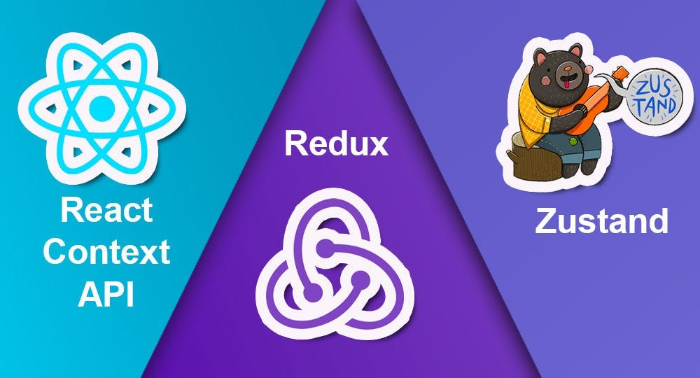
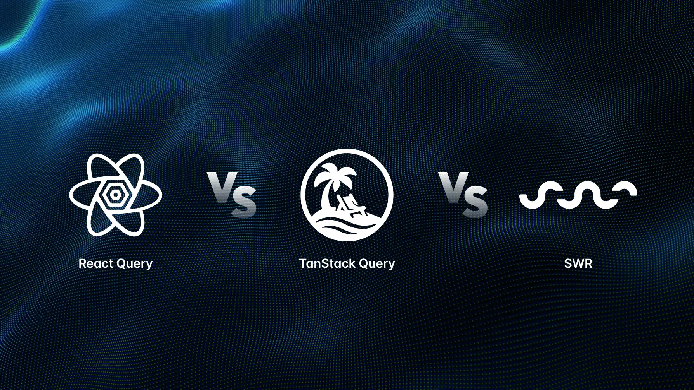

# DWEC UT07: Librerias complementarias en React.

## Desarrollo con React 

El ecosistema de **React** ha evolucionado de ser una simple librería de interfaz a un universo modular donde su verdadero potencial se desbloquea mediante librerías complementarias. Aunque el núcleo de React *gestiona el renderizado* de forma excelente, las aplicaciones modernas demandan soluciones robustas para desafíos que van más allá del componente individual.

Dominar estas herramientas es esencial para construir software **escalable**. En la actualidad, la arquitectura de una aplicación profesional se apoya en pilares fundamentales:

* **Estado Global**: Herramientas ligeras y potentes como **Zustand** o **Recoil** han simplificado la gestión de datos compartidos, sustituyendo la complejidad de *Redux* en muchos proyectos.

 

* **Gestión de Datos**: Para la sincronización con servidores, **TanStack Query** (antes React Query) o **SWR** se han vuelto imprescindibles para manejar el caché y la carga asíncrona de forma eficiente.

 

* **Formularios y Validación**: La captura de datos se vuelve segura y sencilla combinando **React Hook Form** con librerías de esquemas como **Zod**, garantizando integridad de tipos desde el cliente.

 

* **Componentes de UI**: La velocidad de desarrollo se potencia con sistemas de diseño como **Material UI** (MUI) o **Chakra UI**, que ofrecen componentes accesibles y estéticos listos para usar.

 

La integración inteligente de estas bibliotecas permite transformar una aplicación básica en una plataforma de alto rendimiento, optimizando tanto la experiencia del usuario como la del desarrollador.

## Ventajas de utilización de librerias

Utilizar librerías complementarias en React (librerías de terceros, componentes UI, gestores de estado, etc.) ofrece numerosas ventajas para el desarrollo de aplicaciones web, permitiendo a los equipos de desarrollo escalar sus **proyectos más rápido y con mayor calidad**. 

Aquí se describen las principales ventajas:

* Aceleración del Desarrollo (**Productividad**): Las librerías de componentes preconstruidos (UI) eliminan la necesidad de programar elementos comunes desde cero (botones, modales, formularios, tablas), lo que permite lanzar aplicaciones rápidamente y ahorrar tiempo.
* **Consistencia** en UI/UX: Al utilizar bibliotecas de componentes (como Material UI, Chakra UI, o Shadcn/ui), se garantiza una apariencia y comportamiento uniforme en toda la aplicación, lo que resulta en una mejor experiencia de usuario y diseño profesional sin esfuerzo adicional.
* **Reutilización** y **Mantenimiento**: El uso de componentes probados y estandarizados fomenta un código más limpio, escalable y fácil de mantener.
* **Mejor Gestión de Estado y Datos**: Librerías especializadas (como React Query, Redux o Zustand) simplifican la gestión de estados complejos, el almacenamiento en caché automático y la obtención de datos, reduciendo el código repetitivo y los errores en el manejo de API.
* **Accesibilidad** (a11y) y **Responsividad**: Muchas librerías populares vienen con características de accesibilidad integradas (ARIA guidelines) y diseños responsivos, asegurando que la aplicación sea usable en diferentes dispositivos sin que el desarrollador tenga que configurarlo desde cero.
* Soluciones "**Probadas en Batalla**": Estas librerías suelen ser utilizadas por miles de desarrolladores, lo que significa que la mayoría de los errores comunes ya han sido detectados y solucionados.

Pero tambien tenemos alguna desventaja que tambíen hay que comentar:

* **Mayor tamaño** del bundle y **problemas de rendimiento**: La inclusión de muchas dependencias externas puede inflar el tamaño final del archivo JavaScript (bundle size), resultando en tiempos de carga más lentos y una peor experiencia de usuario, especialmente en dispositivos móviles.
* **Vulnerabilidades de seguridad**: Las librerías de terceros pueden introducir fallos de seguridad. Si una dependencia no se mantiene actualizada o es maliciosa, puede comprometer la integridad de la aplicación.
* "Dependency Hell" (**Conflictos de dependencias**): Usar múltiples librerías puede generar incompatibilidades entre ellas o con la versión actual de React, lo que dificulta la gestión del proyecto y complica la depuración.
* **Mantenimiento y abandono**: Si el autor de la librería deja de darle soporte, tu proyecto dependerá de código obsoleto. Esto obliga a los equipos a realizar parches propios o buscar alternativas urgentes.
* **Limitaciones en la personalización**: Las bibliotecas de UI prefabricadas suelen ser difíciles de personalizar más allá de lo que permite su API. Sobrescribir estilos CSS puede volverse más lento que construir el componente desde cero.