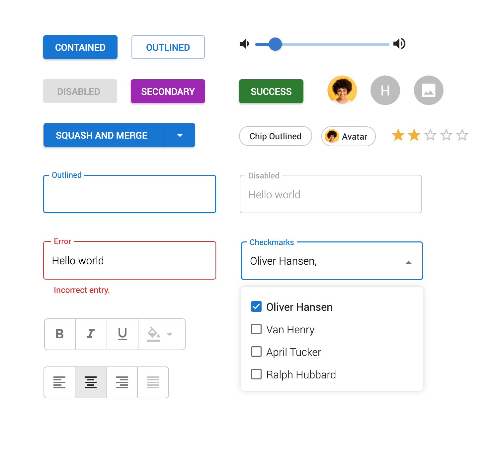
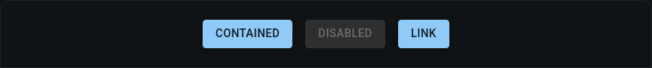
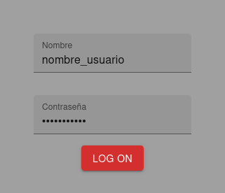
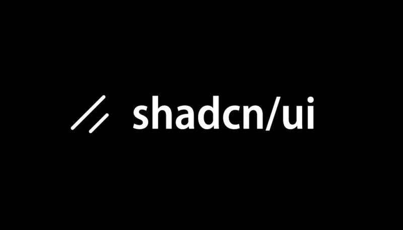

# DWEC UT07: Librerias complementarias en React.

## Material UI 

MUI (antes llamada Material-UI) es una **librería de componentes de interfaz de usuario (UI) para React** que permite crear aplicaciones web modernas, profesionales y responsivas de manera rápida.

Está basada en el sistema de diseño **Material Design** de Google, pero actualmente MUI también permite crear diseños completamente personalizados, no necesariamente siguiendo ese estilo.

Funciona sobre React, por lo que se usa principalmente en proyectos desarrollados con este framework.

### Utilidades de la librería

Cuando desarrollas una aplicación web, necesitas muchos elementos visuales:

* Botones
* Formularios
* Tablas
* Ventanas emergentes
* Menús
* Barras de navegación
* Tarjetas de contenido

Podrías crear todo esto desde cero usando HTML y CSS, pero eso requiere mucho tiempo y esfuerzo. MUI te proporciona componentes ya diseñados, optimizados y accesibles, listos para usar. Esto permite:

* Ahorrar tiempo de desarrollo
* Mantener una interfaz consistente
* Mejorar la experiencia del usuario
* Tener diseño profesional desde el inicio

MUI incluye una gran variedad de componentes, entre los más usados están:

* **Button** → Botones con distintos estilos (texto, contenedor, outlined). [Enlace](https://mui.com/material-ui/react-button/).
* **TextField** → Campos de texto para formularios. [Enlace](https://mui.com/material-ui/react-text-field/).
* **Dialog** → Ventanas modales. [Enlace](https://mui.com/material-ui/react-dialog/).
* **AppBar** → Barras superiores de navegación. [Enlace](https://mui.com/material-ui/react-app-bar/).
* **Drawer** → Menús laterales. [Enlace](https://mui.com/material-ui/react-drawer/).
* **Card** → Tarjetas de contenido. [Enlace](https://mui.com/material-ui/react-card/).
* **DataGrid** → Tablas avanzadas con paginación y filtros. [Enlace](https://mui.com/x/react-data-grid/?_gl=1*1gcd25f*_up*MQ..*_ga*NTgwNTMzODQxLjE3NzE5MjcxMzM.*_ga_5NXDQLC2ZK*czE3NzE5MjcxMzIkbzEkZzAkdDE3NzE5MjcxMzIkajYwJGwwJGgw).

Aqui podeis ver algunos de los ejemplos mas tipicos de utilización de elementos que podemos utilizar con MUI.

<p align="center"> 

</a>
</p>

```jsx
import Button from '@mui/material/Button';
import Stack from '@mui/material/Stack';

export default function ContainedButtons() {
  return (
    <Stack direction="row" spacing={2}>
      <Button variant="contained">Contained</Button>
      <Button variant="contained" disabled>
        Disabled
      </Button>
      <Button variant="contained" href="#contained-buttons">
        Link
      </Button>
    </Stack>
  );
}
```
Cada componente tiene diferentes cariantes de colores y configuración de aspecto básicas para poder configurar un poco los componentes a nuestros gustos y necesidades.
Veamos algunas opciones y como quedarian en el navegador.

<p align="center"> 

</a>
</p>

Aqui tenéis otro ejemplo de utilización de 2 `TextFields` para introducir nombre de usuario y contraseña y un `Button` para que podamos enviar esa información a donde veamos oportuno.

```jsx
import Button from '@mui/material/Button';
import Box from '@mui/material/Box';
import TextField from "@mui/material/TextField";
import './App.css'

function App () {

  return (
    <>
      <div>
      <div className="card">
        <Box component="form" sx={{"& .MuiTextField-root": { m: 2,width: "25ch"},}}>
          <div className="email input">
            <TextField
              id="filled-required"
              label="Nombre"
              variant="filled"
            />
          </div>
          <div className="password input">
            <TextField
              id="filled-password-input"
              label="Contraseña"
              type="password"
              autoComplete="current-password"
              variant="filled"
            />
          </div>
          <Button variant="contained" color="error">log on</Button>
        </Box>
      </div>
    </>
  )
}

export default App

```
<p align="center"> 

</a>
</p>

Una de las opciones de MUI es que no solo ofrece componentes, sino también un sistema de diseño completo:

* Sistema de temas (Theme Provider)
* Modo claro y modo oscuro
* Personalización de colores
* Tipografías configurables
* Sistema de espaciado
* Diseño responsive

Esto significa que puedes mantener coherencia visual en toda tu aplicación con una configuración centralizada. Eso si, el este camino implica una curva de aprendizaje con el sistema de customización implementado por MUI.

MUI se utiliza principalmente cuando **se necesita desarrollar rápidamente una interfaz de usuario (UI) profesional**, consistente y responsiva. Es ideal para acelerar el desarrollo de aplicaciones web y móviles, reduciendo el tiempo de creación de componentes desde cero.

## ShadCN 

**ShadCN** UI es una biblioteca relativamente nueva pero que está ganando terreno rápido, especialmente entre desarrolladores que usan *Tailwind CSS*. Su filosofía es simple: **ofrecer componentes React sin estilos visuales predefinidos**, limitándose a la funcionalidad y estructura. Eso permite un control muy grande sobre el diseño, usando directamente las utilidades de Tailwind.

<p align="center"> 

</a>
</p>

### Ventajas que ofrece

* **Flexibilidad** absoluta: Puedes crear tu tema y estilo sin pelear con estilos que no te gustan y tienes un control completo.
* **Ligereza y rendimiento**: Los componentes no agregan peso innecesario, mejorando performance.
* **Integración** perfecta con **Tailwind**: Si ya conoces Tailwind, te sentirás en casa.
* **Código modular y claro**: Al separar estructura y estilos, se mantiene el código limpio y fácil de mantener.

### Limitaciones

* Curva de aprendizaje inicial alta: Si no dominas Tailwind, puede parecer complejo al principio.
* Menos componentes listos: Aunque la comunidad crece, aún no tiene la cantidad de widgets completos que Material UI ofrece.
* Accesibilidad bajo tu responsabilidad: A diferencia de Material UI, no viene “listo para usar” en términos de ARIA y soporte para todos los usuarios.

### Utilización de la librería

En este caso, el funcionamiento de la librería y la de sus componentes es un poco diferente a la de MUI. Pero lo bueno es que en la documentación oficial podréis encontrar multitud de ejemplos y ayuda para su utilización ([Pagina oficial](https://ui.shadcn.com/)).

Aqui teneis un sencillo video para configurar ShadCN utilizando Vite y JS (se siguen los mismos pasos que en el [tutorial](https://ui.shadcn.com/docs/installation/vite) de la pagina oficial).

<p align="center"> 
<a href="https://www.youtube.com/watch?v=aMX_DYK5LAk">

</a>
</p>

Una vez visto como instalar y trabajar con un componente, podemos empezar a ver como trabajar con el resto de componentes de ShadCN. La propia página tiene una lista con todos los [componentes](https://ui.shadcn.com/docs/components) utilizables con ejemplos y código para su descarga.