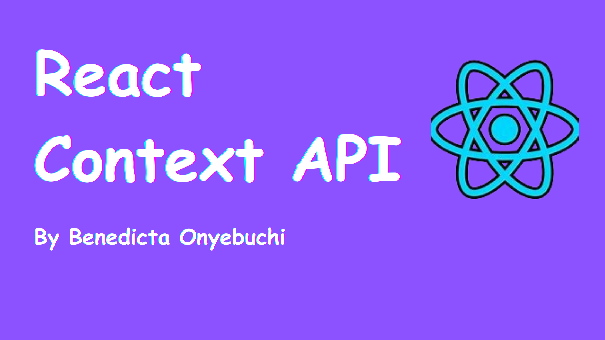
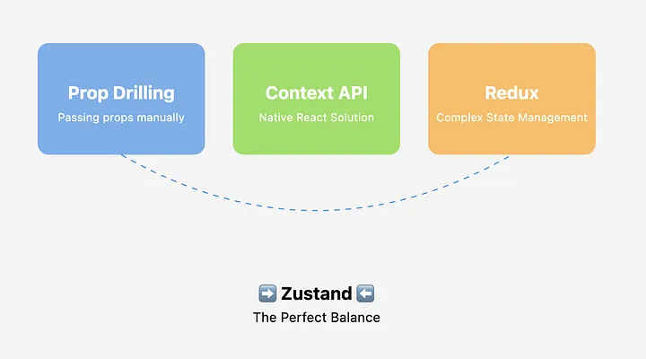

# DWEC UT07: Librerias complementarias en React.

En React el estado es un objeto que contiene datos relevantes para un componente. En el estado de un componente, estos datos pueden cambiar a lo largo del tiempo y afectar la representación en pantalla del componente o almacenarse en memoria para poder utilizarlos en otro momento, según las necesidades.

Hasta el momento hemos visto como pasar esos estados entre componentes utilizando las *props*.

```jsx
// App.js

import React, { useState } from 'react';

const GrandchildComponent = ({ dataFromChild }) => {
  return (
    <div>
      <p>Username in Grandchild: {dataFromChild.username}</p>
    </div>
  );
};

const ChildComponent = ({ dataFromParent }) => {
  return (
    <div>
      <p>Your email: {dataFromParent.email}</p>
      <GrandchildComponent dataFromChild={dataFromParent} />
    </div>
  );
};

const ParentComponent = () => {
  const [userData, setUserData] = useState({
    username: 'benny_dicta',
    email: 'benedictaonyebuchi@gmail.com',
  });

  return (
    <div>
      <h1>Welcome, {userData.username}!</h1>
      <ChildComponent dataFromParent={userData} />
    </div>
  );
};

const App = () => {
  return <ParentComponent />;
};

export default App;
```

## React Context API 

El contexto (**Context**) es un mecanismo para compartir valores entre componentes sin pasar *props* explícitamente en cada nivel del árbol.

**useContext** es un Hook de React que permite acceder a datos globales dentro de tu aplicación sin tener que pasar props manualmente de componente en componente (lo que se conoce como *prop drilling*).

Para usar **useContext**, primero debes crear un contexto. Un contexto es esencialmente un lugar centralizado donde puedes almacenar y compartir datos entre componentes sin necesidad de pasarlos manualmente a través de *props*.

En este ejemplo, hemos creado un contexto *UserContext* y lo hemos configurado en el componente raíz de la aplicación. Hemos proporcionado un objeto *user* como valor en el UserContext.Provider.

```jsx
import React, {createContext} from 'react';
import Greetings from './Greetings';

const UserContext = createContext()

export function App (){
  const user = {
    nombre: "Manolo",
    email: "manolo@educacion.com"
  }

  return (
    <UserContext.Provider value={user}>
    <Greetings />
    </UserContenxt.Provider>
  )
}
```

Para consumir el contexto en un componente, utilizamos el hook **useContext**. Con **useContext**, podemos acceder a los datos proporcionados por el contexto y utilizarlos en cualquier parte de la aplicación.

```jsx
import React, {useContext} from 'react';

export function Greetings (){
  const usuario = useContext(UserContext)

  return (
    <p> Hola, {usuario.nombre}!</p>
  )
}
```

Como vemos aqui tenemos varios apartados importantes:

* **Provider**: Este es un componente que se utiliza para envolver componentes con el fin de acceder al valor del contexto. Aquí es donde pasa los valores que desea compartir en todo el árbol de componentes utilizando la prop *value*. 
* **Context**: Esto actúa como el almacenamiento donde se almacenan los datos. Viene con dos partes:
  * `createContext()`: Esto crea el objeto global y crea el contexto.
  * `useContext()`: Esto consume la información facilitada por el proveedor.
* **Consumer**: El componente de consumidor se utiliza para consumir los datos compartidos dentro de un componente. Permite a los componentes suscribirse a los cambios de contexto y acceder al valor compartido.

<p align="center"> 
<a href="https://www.freecodecamp.org/news/how-to-use-react-context/">

</a><br>
<i><a href="https://www.freecodecamp.org/news/how-to-use-react-context/">Aqui podeis encontrar un ejemplo práctico para cambiar el color de apariencia de una web</a></i>
</p>

## Redux (Redux-toolkit)

Sabemos que existen varias formas de gestionar el estado en React (estado local, contextos, useReducer…) y **Redux** es especialmente útil en proyectos de gran envergadura, donde la comunicación entre distintos nodos se vuelve crucial. Aunque en este ejemplo práctico lo veremos en una aplicación sencilla para que sea más entendible.

Desde sus inicios, Redux ha evolucionado de manera muy positiva, proporcionando a todos los componentes de React una única fuente de verdad a la que pueden acceder y modificar según las necesidades del proyecto.

Lo primero que tenemos que hacer sera la instalación de las librerias en nuestro proyecto (en caso de npm):

```bash
npm install @reduxjs/toolkit react-redux
```

### Ejemplo básico

Todo el estado global de tu aplicación se almacena en un árbol de objetos dentro de un solo **store**. La única manera de cambiar el árbol de estado es crear una **acción**, un objeto que describa lo que ocurre y "despacharlo" (*dispatch*) al **store**. Para especificar cómo se actualiza el estado en respuesta a una acción, escribe funciones **reducer** puras que calculen un nuevo estado en función del estado antiguo y la acción.

Redux Toolkit simplifica el proceso de escribir la lógica de Redux y configurar la tienda. Con Redux Toolkit, la lógica básica de la aplicación se parece a:

```jsx
import { createSlice, configureStore } from '@reduxjs/toolkit'

const counterSlice = createSlice({
  name: 'counter',
  initialState: {
    value: 0
  },
  reducers: {
    incremented: state => {
      state.value += 1
    },
    decremented: state => {
      state.value -= 1
    }
  }
})

export const { incremented, decremented } = counterSlice.actions

const store = configureStore({
  reducer: counterSlice.reducer
})

// Can still subscribe to the store
store.subscribe(() => console.log(store.getState()))

// Still pass action objects to `dispatch`, but they're created for us
store.dispatch(incremented())
// {value: 1}
store.dispatch(incremented())
// {value: 2}
store.dispatch(decremented())
// {value: 1}
```

En lugar de mutar el estado directamente, se especifiquan las mutaciones que queremos que ocurran con objetos sencillos llamados **acciones**. Luego se escribe una función especial llamada **reducer** para decidir cómo cada acción transforma el estado de toda la aplicación.

En una aplicación típica de *Redux*, solo hay un solo **store** con una sola función *reducer* raíz. A medida que la aplicación crece, divide el *reducer*  raíz en *reducers* más pequeños que operan de forma independiente en las diferentes partes del árbol de estado. 

Esto es exactamente lo que ocurre en una aplicación de React con un solo componente que esta despues compuesto por muchos otros componentes.

<p align="center"> 
<a href="https://www.paradigmadigital.com/dev/como-implementar-redux-react-hooks/">

</a><br>
<i><a href="https://www.paradigmadigital.com/dev/como-implementar-redux-react-hooks/">Aqui podeis encontrar un ejemplo práctico mas completo</a></i><br>
<i><a href="https://embed17.medium.com/getting-started-with-redux-in-reactjs-310317-92a1d895d408">Otro ejemplo práctico mas completo</a></i>
</p>

## Zustand

**Zustand**, una librería elegante y minimalista para el manejo del estado en React, se presenta como una solución ligera y eficaz para el manejo del estado en aplicaciones React, ideal para aquellos que buscan simplicidad sin sacrificar la funcionalidad.

A diferencia de otras soluciones de manejo de estado más robustas (y a veces más complejas) como **Redux**, *Zustand* ofrece una API sencilla y directa, facilitando la creación y gestión de estados globales, sin la necesidad de envolver componentes en proveedores de contexto o lidiar con una configuración extensa.

Una de las grandes ventajas de *Zustand* es su enfoque "hook-centric", ya que utiliza hooks de React, como useStore, para acceder y manipular el estado global. Esto se traduce en un código más limpio y declarativo, fácil de leer y mantener.

### Instalación de Zustand

Para instalar la dependencia de Zustand, ejecutaremos el siguiente comando:

```bash
npm install zustand
```

Para configurar Zustand en nuestro proyecto necesitaremos definir nuestro store. Podemos definir tantos stores como queramos, ya que cada uno de ellos puede tener sentido en ciertas partes de nuestra aplicación. Para definir un store es recomendable utilizar un nuevo fichero. 

```jsx
// counter.store.js
import create from 'zustand';

// Creación
const useCounterStore = create((set) => ({
    count: 0,
    increment: () => set((state) => ({ count: state.count + 1 })),
    decrement: () => set((state) => ({ count: state.count - 1 })),
}));

export default useCounterStore;
```

Una vez definido nuestro **store**, podemos utilizarlo en cualquiera de nuestras páginas o componentes dentro de nuestra aplicación. Importándolo y extrayendo los atributos o métodos que vamos a utilizar.

```jsx
// App.jsx

import './App.css'
import useCounterStore from './store/counter.store.ts';

function App() {
  const { count, increment, decrement } = useCounterStore();
  return (
    <>
      <h1>Vite + React + Zustand</h1>
<div>
            Zustand count: {count}
            <button onClick={increment}>Increment store count</button>
            <button onClick={decrement}>Decrement store count</button>
       </div>
    </>
  )
}

export default App
```

El ejemplo anterior tendría el mismo funcionamiento que un useState definido a nivel de página o componente.

```jsx
// App.jsx

import './App.css'
import {useState} from "react";

function App() {
    const [count, setCount] = useState(0)
    return (
        <>
            <h1>Vite + React</h1>
            <div>
                useState count: {count}
                <button onClick={() => setCount((count) => count + 1)}>
                    Increment useState count
                </button>
                <button onClick={() => setCount((count) => count - 1)}>
                    Decrement useState count
                </button>
            </div>
        </>
    )
}

export default App
```

La principal diferencia entre **Zustand** y **useState** radica en su alcance y enfoque para manejar el estado en aplicaciones.

**Zustand** proporciona un sistema de gestión de estado centralizado que permite compartir el estado entre múltiples componentes de manera eficiente.

Por otro lado, **useState** es una característica de React que se utiliza para gestionar el estado local de componentes individuales de manera más simple y directa.

<p align="center"> 
<a href="https://medium.com/@nirpendra09/getting-started-with-zustand-in-react-fe02c1bb2cee">

</a>
<i><a href="https://medium.com/@nirpendra09/getting-started-with-zustand-in-react-fe02c1bb2cee">Aqui podeis encontrar un ejemplo práctico mas completo (y caracteristicas más avanzadas)</a></i>
</p>