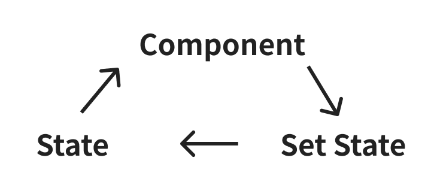
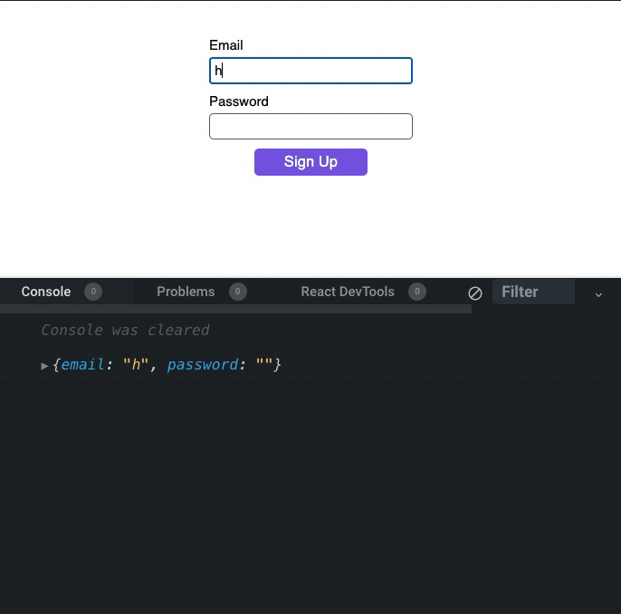
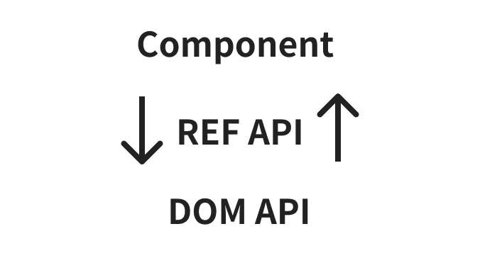
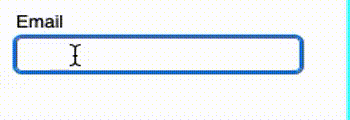
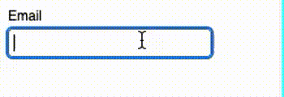
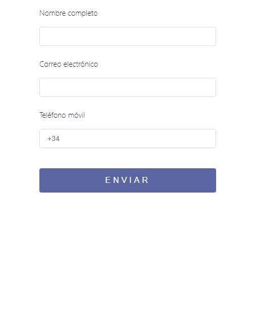

# DWEC UT07: Librerias complementarias en React.

El uso de formularios en desarrollo web es fundamental a la hora de crear aplicaciones interactivas ya que con ellos podemos validar y enviar información a nuestros servidores. La verdad es que trabajar con formularios puede ser más desafiante de lo que pudiéramos creer.

Para crear un buen formulario, debemos tener en cuenta los siguientes aspectos:

* **Accesibilidad**: Millones de usuarios en el mundo sufren algún tipo de discapacidad y navegan los sitios web a través de herramientas diferentes al mouse y el teclado, por lo tanto, debemos tener en cuenta la semántica de los elementos HTML que usemos para crear el formulario, además no será suficiente usar las estrategias de validación convencionales propuestas por los navegadores.
* **Validación**: Cada campo que existe en el formulario puede tener unas reglas particulares. Unos campos pueden ser opcionales, otros obligatorios, también permiten ingresar correos electrónicos, pueden requieren valores mínimos o máximos, entre otros. Comunicar a todos los usuarios acerca de los valores permitidos en un campo específico es una función fundamental de las validaciones de campos.
* **Serialización**: Cuando un usuario ha terminado de diligenciar el formulario, su información se encuentra en algún espacio de memoria en el que usa la aplicación. Obtener esa información, manipularla y enviarla adecuadamente puede ser un reto en algunas ocasiones.

## Patrones de React para crear formularios

### Componentes controlados

Un componente `controlado` es aquel que usa los cambios de estado o cambios de *props* como fuente de verdad para representarse en el DOM.

De manera más concreta, es un componente que mantiene una sincronización entre el estado de React y el valor del campo, si el estado cambia, el valor cambia.

Puedes pensar en el cómo un proceso cíclico; Relación entre un componente, su cambio de estado y el estado en sí mismo

<p align="center"> 
<br>
</p>

```jsx
import React from "react";

function Form() {
  const [values, setValues] = React.useState({
    email: "",
    password: "",
  });

  function handleSubmit(evt) {
    // Previene el comportamiento default de los formularios el cual recarga el sitio
    evt.preventDefault();

    // Aquí puedes usar "values" para enviar la información
  }

  function handleChange(evt) {
    // evt.target es el elemento que ejecuto el evento, name identifica el input y value describe el valor actual

    const { target } = evt;
    const { name, value } = target;

    // 1. Clona el estado actual
    // 2. Reemplaza solo el valor del input que ejecutó el evento

    const newValues = {
      ...values,
      [name]: value,
    };

    // Sincroniza el estado de nuevo
    setValues(newValues);
  }

  return (
    <form onSubmit={handleSubmit}>
      <label htmlFor="email">Email</label>
      <input
        id="email"
        name="email"
        type="email"
        value={values.email}
        onChange={handleChange}
      />
      <label htmlFor="password">Password</label>
      <input
        id="password"
        name="password"
        type="password"
        value={values.password}
        onChange={handleChange}
      />
      <button type="submit">Sign Up</button>
    </form>
  );
}
```

<p align="center"> 
<br>
</p>

### Componentes NO controlados

Un componente `no controlado`, es aquel que no usa el estado o las *props* para representarse en el DOM, y, por el contrario, usa la [API del DOM](https://developer.mozilla.org/en-US/docs/Web/API/HTML_DOM_API). La manera en la que React obtiene los valores es usando la [API de REF](https://react.dev/learn/manipulating-the-dom-with-refs).

<p align="center"> 
<br>
</p>

```jsx
import React from "react";
import {useRef} from "react";

function Form() {
  const formRef = useRef();

  function handleSubmit(evt) {
    evt.preventDefault();
    /*
        1. Usamos FormData para obtener la información
        2. FormData requiere la referencia del DOM,
           gracias al REF API podemos pasar esa referencia
        3. Finalmente obtenemos los datos serializados
      */
    const formData = new FormData(formRef.current);
    const values = Object.fromEntries(formData);

    // Aquí puedes usar values para enviar la información
  }

  return (
    <form onSubmit={handleSubmit} ref={formRef}>
      <label htmlFor="email">Email</label>
      <input id="email" name="email" type="email" />
      <label htmlFor="password">Password</label>
      <input id="password" name="password" type="password" />
      <button type="submit">Submit</button>
    </form>
  );
}
```

## Validación de Formularios

Las validaciones en los formularios buscan guiar y comunicar al usuario sobre los valores adecuados que cada uno de los campos espera almacenar. Los casos de uso son numerosos, a veces se busca que tenga un rango especifico de caracteres, otras veces queremos que cumpla un patrón de texto preciso, o quizás queremos que responda frente a un campo previamente ingresado.

Para calcular si los valores del campo son correctos o incorrectos podemos ejecutar una serie de evaluaciones en nuestra base de código que pueden ocurrir de manera síncrona o asíncrona.

### Validaciones Síncronas

Una validación **síncrona** es aquella que evalúa el estado del campo en el hilo principal de Javascript. La mayoría de las validaciones son de este tipo, y los casos de uso más normales son validaciones de correos electrónicos, nivel de seguridad de contraseña, y para generalizar, todo aquello que sea posible usando [Regexp].

```jsx
import React from "react";
import {useState} from "react";

const emailRegexp = new RegExp(/[^@ \t\r\n]+@[^@ \t\r\n]+\.[^@ \t\r\n]+/);

function Form() {
  const [emailField, setEmailField] = useState({
    value: "",
    hasError: false,
  });

  function handleChange(evt) {
    // Esta función es la misma usada en la sección de componentes controlados
  }

  function handleBlur() {
    /*
      1. Evaluamos de manera síncrona si el valor del campo no es un correo valido.

      2. Recordar que este método se llama cada vez que abandonamos el campo y evita que el usuario reciba un error sin haber terminado
      de poner el valor.
    */

    const hasError = !emailRegexp.test(emailField.value);
    setEmailField((prevState) => ({ ...prevState, hasError }));
  }

  return (
    <form>
      <label htmlFor="email">Email</label>
      <input
        id="email"
        name="email"
        value={emailField.value}
        onChange={handleChange}
				{/* onChange para sincronizar el valor del campo */}
        onBlur={handleBlur} 
				{/* onBlur para sincronizar la validación del campo */}
        aria-errormessage="emailErrorID"
        aria-invalid={emailField.hasError}
      />
      {/*
          1. Solo muestra el mensaje de error cuando hasError sea true
          2. Crea una relación lógica entre el campo y el mensaje de error, favoreciendo la semántica y la accesibilidad del campo.
        */}
      <p
        id="msgID"
        aria-live="assertive"
        style={{ visibility: emailField.hasError ? "visible" : "hidden" }}
      >
        Please enter a valid email
      </p>
    </form>
  );
}
```

<p align="center"> 
<br>
</p>

### Validaciones Asíncronas

Las validaciones **asíncronas** son aquellas que determinen el estado del campo usando algún servicio externo que bloquea el hilo principal de Javascript.

Suelen ser usados para comparar valores que ingresa el usuario contra una base de datos, verificar si una dirección es válida, si un correo no está en uso, si un nombre de usuario ya ha sido registrado, entre otros.

```jsx
import React from "react";
import {useState} from "react";

function getEmailAvailability(email) {
  /*
    Imaginemos que tenemos un servicio que valida si el correo enviado está disponible o no
  */
}

function Form() {
  const [emailField, setEmailField] = useState({
    value: "",
    hasError: false,
  });

  function handleChange(evt) {
    // Esta función es la misma usada en la sección de componentes  controlados
  }

  async function handleBlur() {
    // Llamamos al servicio y definimos si hay o no error

    const hasError = await getEmailAvailability(emailField.value);
    setEmailField((prevState) => ({ ...prevState, hasError }));
  }

  return (
    <form>
      <label htmlFor="email">Email</label>
      <input
        id="email"
        name="email"
        value={emailField.value}
        onChange={handleChange}
        onBlur={handleBlur}
        aria-errormessage="emailErrorID"
        aria-invalid={emailField.hasError}
      />
      <p
        id="msgID"
        aria-live="assertive"
        style={{ visibility: emailField.hasError ? "visible" : "hidden" }}
      >
        This email is already registered
      </p>
    </form>
  );
}
```

<p align="center"> 
<br>
</p>

El tipo de evaluación que hacemos es asíncrono, en este caso estamos haciendo una llamada a un servicio (que para este ejemplo estamos simulando pero podría ser una consulta a una API). `handleValidation` pasa a ser una función **asíncrona**. Luego de que la llamada al servicio concluya ocurrirá un cambio de estado con la respuesta del servidor (correo disponible o no).

## React Hook Form

React Hook Form nos ofrece la capacidad de desarrollar nuestros formularios de manera **no controlada**, independizando todo cambio que pueda producirse en cada uno de los elementos del formulario, evitando con ello renders innecesarios, haciendo uso de hooks y con una sencillez total.

Todo la API de `react-hook-form` como lo dice su nombre, está basado en hooks. Su hook principal es `useForm()`.

```jsx
import React from "react";
import { useForm } from "react-hook-form";

function HookForm() {
  const { register, handleSubmit } = useForm();

  function onSubmit(values) {
    // Aquí puedes usar values para enviar la información
  }

  return (
    <form onSubmit={handleSubmit(onSubmit)}>
      <label htmlFor="email">Email</label>
      <input type="email" {...register("email")} />
      <label htmlFor="password">Password</label>
      <input type="password" {...register("password")} />
      <button type="submit">Sign Up</button>
    </form>
  );
}
```

`useForm` nos retorna dos métodos, `register` y `handleSubmit`.
* `register` se usa en cada uno de los campos, está es la manera como se sincroniza el estado con el formulario.
* `handleSubmit` se usa para especificar el método que debe de ejecutarse cuando el formulario es guardado.
* Cada input usa `register` describiendo el **identificador del campo**.
* Cuando el evento de submit ocurre, la función `onSubmit` tiene los valores disponibles para ser usados.

<p align="center"> 
<a href="https://www.paradigmadigital.com/dev/desarrollo-formularios-react/">

</a><br>
<i><a href="https://www.paradigmadigital.com/dev/desarrollo-formularios-react/">Aqui podeis encontrar mas ejemplos de uso de Zod</a></i>
</p>

## Formik

**Formik** es una biblioteca exclusiva para el manejo de formulario en React y React Native. Se encarga de las abstracciones más comunes, es intuitiva, y finalmente es adoptable por su simplicidad y tamaño.

Está biblioteca ofrece dos modos de uso, la primera es usando un *Provider* llamado `Formik` y tiene algunas ventajas como poder usar los componentes que Formik ha abstraído como `<Field />`, `<ErrorMessage />`, entre otros.

La segunda opción es más minimalista y se usa través de la API de Hooks usando uno de ellos llamado `useFormik()`.

```jsx
import React from "react";
import { useFormik } from "formik";

function Formik() {
  const { handleSubmit, handleChange, values } = useFormik({
    initialValues: {
      email: "",
      password: "",
    },
    onSubmit: async function (values) {
      // Aquí puedes usar values para enviar la información
    },
  });

  return (
    <form onSubmit={handleSubmit}>
      <label htmlFor="email">Email</label>
      <input
        id="email"
        name="email"
        type="email"
        onChange={handleChange}
        value={values.email}
      />
      <label htmlFor="password">Password</label>
      <input
        id="password"
        name="password"
        type="password"
        onChange={handleChange}
        value={values.password}
      />
      <button type="submit">Sign Up</button>
    </form>
  );
}
```

**useFormik** tiene una gran variedad de parámetros que podemos suministrar para controlar el formulario de manera flexible.

En el ejemplo anterior:

* Definimos el estado inicial y la función que debe ejecutarse cuando se envíe el formulario.
* `useFormik` nos devuelve un objeto con diferentes métodos y atributos que definen el estado del formulario.
  * `handleSubmit` contiene la lógica que ejecutara el formulario al guardarse
  * `handleChange` sincroniza el valor de los campos con el estado usando componentes controlados.
  * `values` contiene los valores actuales del formulario
* Le pasamos al formulario y los campos los métodos y valores descritos anteriormente. De esta manera el estado estará disponible para ser usado cada vez que el componente lo requiera.
* Cuando el evento de `submit` ocurre, la función `onSubmit` tiene los valores disponibles para ser usados.

## Zod

**Zod** es una biblioteca de validación de esquemas (enfocada en TypeScript) de primera clase, muy utilizada en React para validar datos en tiempo de ejecución (ej. formularios, respuestas API). Permite asegurar que los datos cumplan con una estructura definida, proporcionando tipos automáticos y mensajes de error claros. 

```jsx
import { z } from 'zod';

const UserSchema = z.object({
  username: z.string().min(3),
  age: z.number().positive(),
});

const resultado = UserSchema.safeParse({
  username: "Juan",
  age: 30,
});

if (resultado.success) {
  console.log("Datos válidos:", resultado.data);
} else {
  console.log("Errores:", resultado.error.format());
}
```

Aqui un ejemplo de como utilizar **Zod** y **React Hook Form**.

```jsx
import React from 'react';
import { useForm } from 'react-hook-form';
import { zodResolver } from '@hookform/resolvers/zod';
import { z } from 'zod';

// Define the schema
const RegistrationSchema = z.object({
  username: z.string().min(3, 'Username must be at least 3 characters long'),
  email: z.string().email('Please enter a valid email address'),
  password: z.string().min(6, 'Password must be at least 6 characters long'),
});

type RegistrationData = z.infer<typeof RegistrationSchema>;

const RegistrationForm: React.FC = () => {
  const {
    register,
    handleSubmit,
    formState: { errors },
  } = useForm<RegistrationData>({
    resolver: zodResolver(RegistrationSchema),
  });

  const onSubmit = (data: RegistrationData) => {
    console.log('Registration Data:', data);
    // Handle form submission
  };

  return (
    <form onSubmit={handleSubmit(onSubmit)}>
      {/* Username Field */}
      <div>
        <label>Username:</label>
        <input type="text" {...register('username')} />
        {errors.username && <p>{errors.username.message}</p>}
      </div>

      {/* Email Field */}
      <div>
        <label>Email:</label>
        <input type="email" {...register('email')} />
        {errors.email && <p>{errors.email.message}</p>}
      </div>

      {/* Password Field */}
      <div>
        <label>Password:</label>
        <input type="password" {...register('password')} />
        {errors.password && <p>{errors.password.message}</p>}
      </div>

      {/* Submit Button */}
      <button type="submit">Register</button>
    </form>
  );
};

export default RegistrationForm;
```

<p align="center"> 
<a href="https://www.rodalexanderson.com/blog/zod-para-validar">

</a><br>
<i><a href="https://www.rodalexanderson.com/blog/zod-para-validar">Aqui podeis encontrar mas ejemplos de uso de Zod</a></i>
</p>